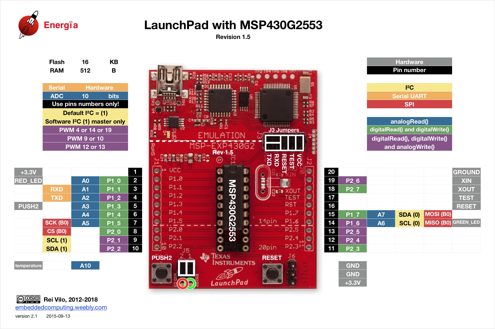
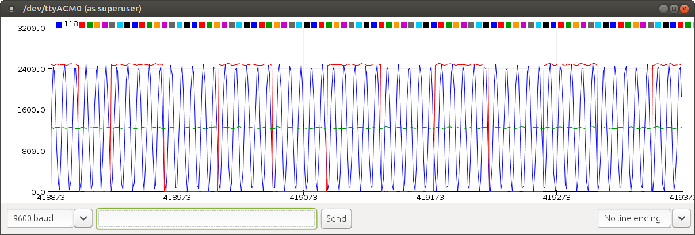
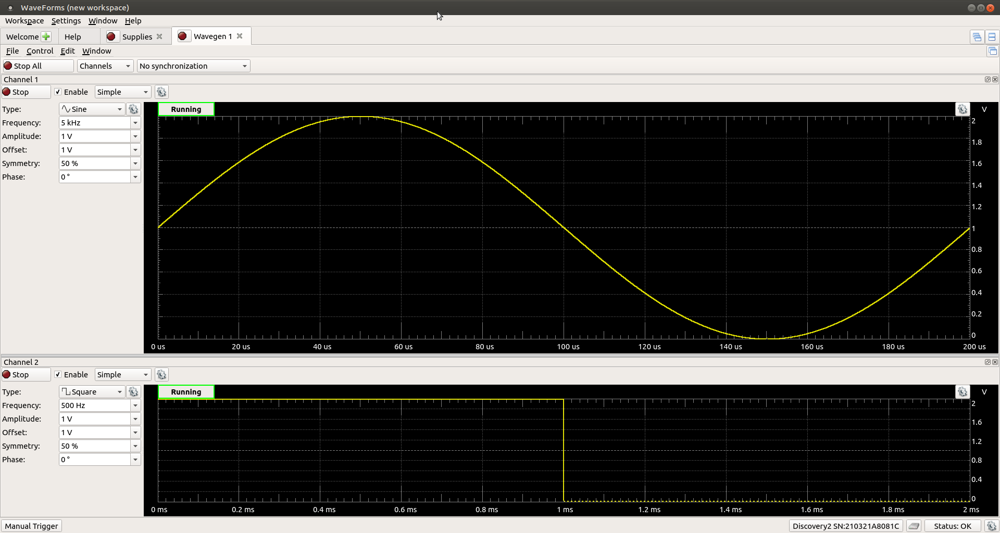

# MSP430 Launchpad Test Code

| Analog Input | Pin |
| ------ | ------ |
| sensorP | A0 |
| sensorV | A1 |
| sensorF | A2 |

**Energia Configuration**

Tools/Board: MSP430G2553

Tools/Progammer: mspdebug

Tools/Port: <serial_port_connected>

**Visualization:**

Tools/SerialPlotter

**Test Signals:**

sensorP: Sine wave,  Amp: 1 Vpp, Offset=1 V, freq=5khz.
sensorV: Square wave, Amp: 1 Vpp, Offset = 1V, freq 500 hz. 
sensorF: 1 VDC. 

